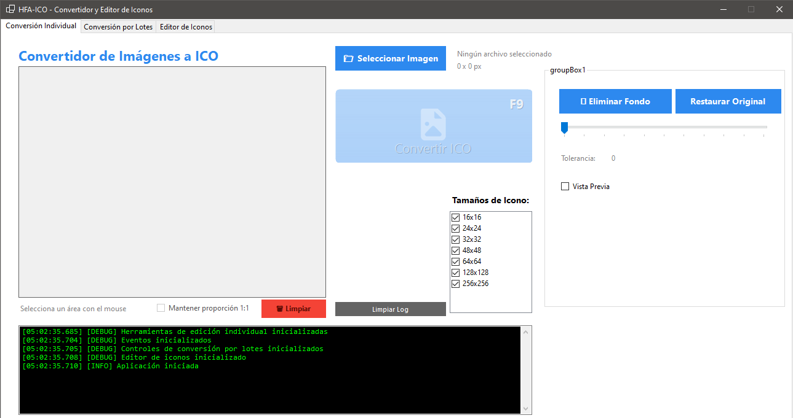
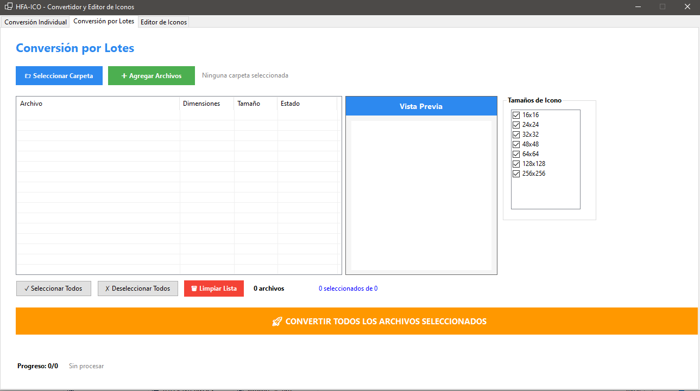
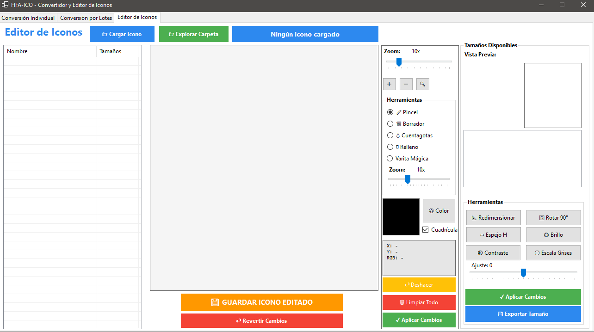

# HFA-ICO

**Conversor de imágenes a iconos (.ico)**

Herramienta desarrollada en C# que permite convertir imágenes a formato de icono de Windows (.ico), tanto de forma individual como por lotes, con la posibilidad de editar los iconos generados.

## Capturas de pantalla


### Vista completa de la aplicación




## Características principales

- **Conversión individual**: Convierte una sola imagen a icono.
- **Conversión por lotes**: Procesa múltiples imágenes al mismo tiempo.
- **Edición de iconos**: Permite modificar los iconos creados (ajustes de tamaño, colores, etc.).
- Interfaz gráfica intuitiva (basada en Windows Forms o similar).
- Soporte para los formatos de imagen más comunes como fuente (PNG, JPG, BMP, etc.).

## Tecnologías utilizadas

- **Lenguaje**: C# (.NET Framework o .NET)
- **Entorno de desarrollo**: Visual Studio (archivo de solución `HFA-ICO.slnx`)

## Requisitos

- Windows (probado en versiones recientes).
- .NET Framework o .NET runtime instalado (versión específica según el proyecto).

## Instalación y uso

1. Clona el repositorio:
   ```bash
   git clone https://github.com/hfaalaniz/HFA-ICO.git

2. Abre la solución en Visual Studio:
	Abre el archivo HFA-ICO.slnx.

3. Compila el proyecto (Build → Build Solution).
4. Ejecuta la aplicación desde el ejecutable generado en la carpeta bin/Debug o bin/Release.

## Uso básico

 - Selecciona una imagen o carpeta con imágenes.
 - Configura las opciones de conversión (tamaños de icono, calidad, etc.).
 - Inicia la conversión.
 - Edita los iconos resultantes si es necesario.

## Contribuciones
¡Las contribuciones son bienvenidas! Si deseas mejorar la herramienta:

 - Haz un fork del repositorio.
 - Crea una rama con tu característica (git checkout -b feature/nueva-funcion).
 - Envía un Pull Request.

## Licencia
Este proyecto se distribuye bajo la licencia MIT.

## Autor
Desarrollado por @hfaalaniz

¡Gracias por usar HFA-ICO!